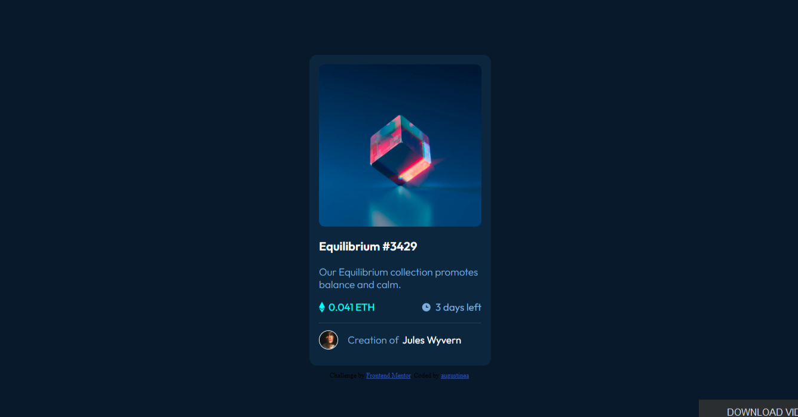
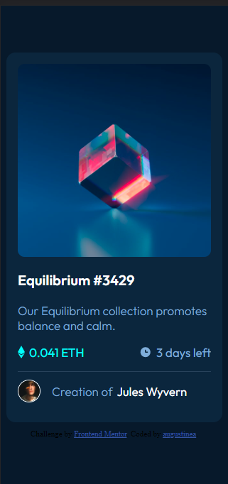

# Frontend Mentor - NFT preview card component solution

This is a solution to the [NFT preview card component challenge on Frontend Mentor](https://www.frontendmentor.io/challenges/nft-preview-card-component-SbdUL_w0U). Frontend Mentor challenges help you improve your coding skills by building realistic projects.

## Table of contents

-   [Overview](#overview)
    -   [The challenge](#the-challenge)
    -   [Screenshot](#screenshot)
    -   [Links](#links)
-   [My process](#my-process)
    -   [Built with](#built-with)
    -   [What I learned](#what-i-learned)
    -   [Useful resources](#useful-resources)
-   [Author](#author)

## Overview

### The challenge

Users should be able to:

-   View the optimal layout depending on their device's screen size
-   See hover states for interactive elements

### Screenshot




### Links

-   Solution URL: [https://github.com/augustine-a8/nft-preview-card-frontend-mentor.git](https://github.com/augustine-a8/nft-preview-card-frontend-mentor.git)
-   Live Site URL: [https://augustine-a8.github.io/nft-preview-card-frontend-mentor/](https://augustine-a8.github.io/nft-preview-card-frontend-mentor/)

## My process

### Built with

-   HTML
-   CSS

### What I learned

Found out about the background-blend-mode css property and how it can be used to blend an image together with a color to yield amazing results

```css
.picture:hover {
    cursor: pointer;
    background-color: var(--clr-soft-blue);
    background-blend-mode: overlay;
    display: flex;
    justify-content: center;
    align-items: center;
}
```

**Note: Delete this note and the content within this section and replace with your own plans for continued development.**

### Useful resources

-   [https://youtu.be/-c94pr41jaI](https://www.example.com) - This video by Kevin Powell revealed to me the existence of background blend mode.
-   [https://canvas.instructure.com/courses/1054116/pages/html-slash-css-basics-show-slash-hide-a-div-with-css](https://www.example.com) - I learned how to control the visibility of a child element through the parent hover state from here.

## Author

-   Frontend Mentor - [@augustine-a8](https://www.frontendmentor.io/profile/@augustine-a8)
